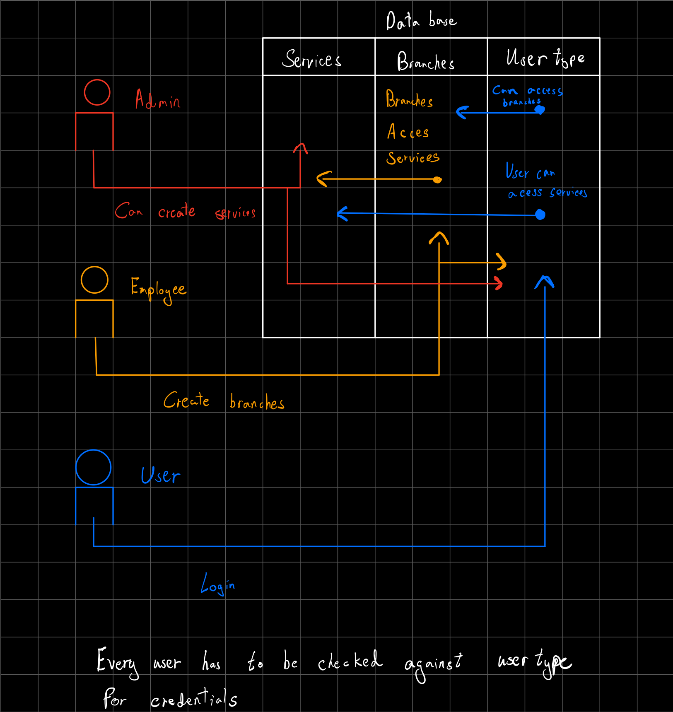
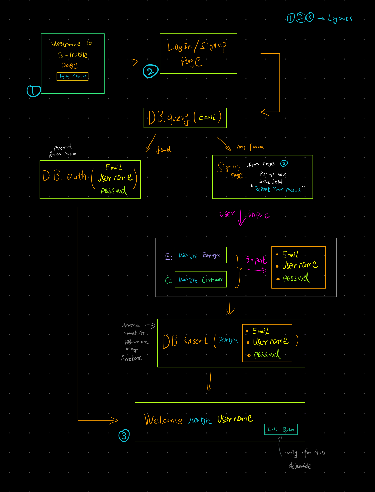
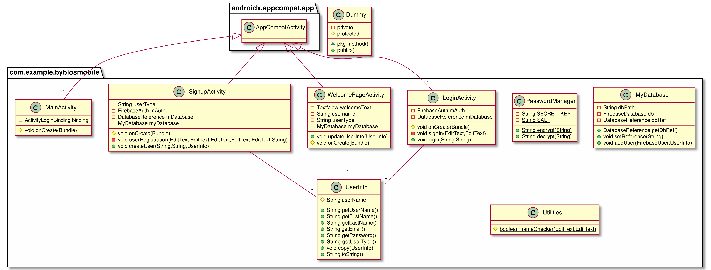
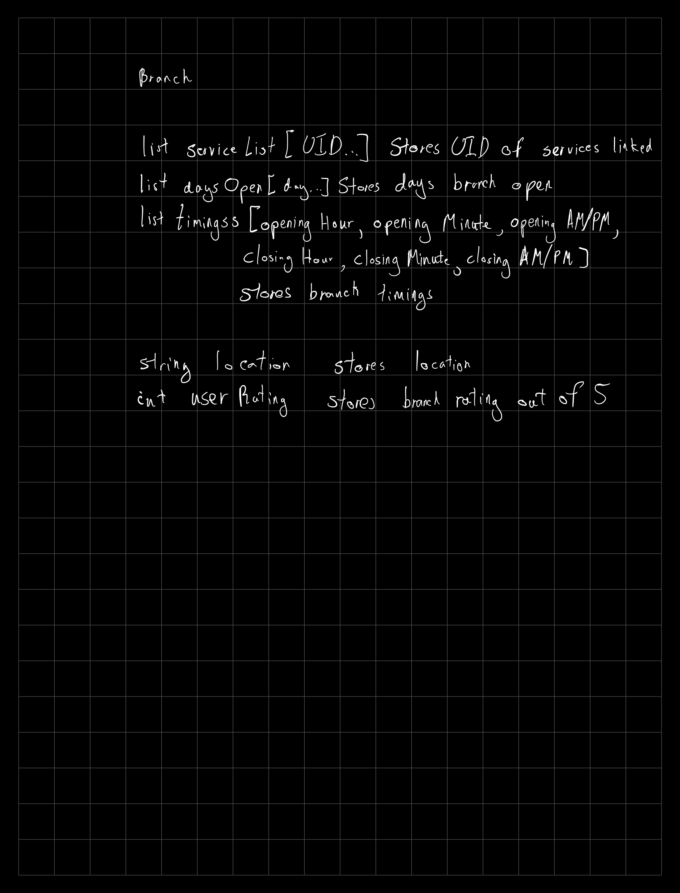
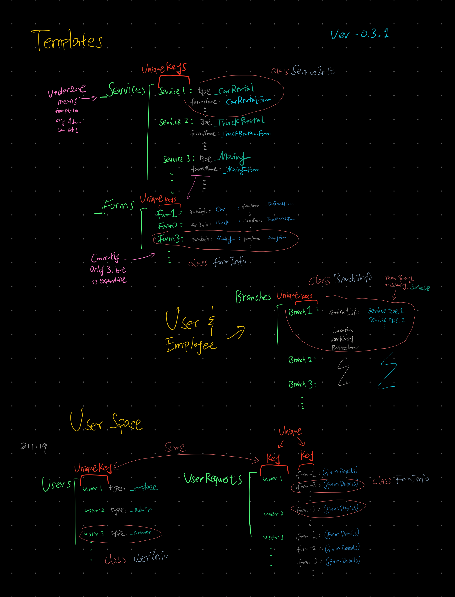
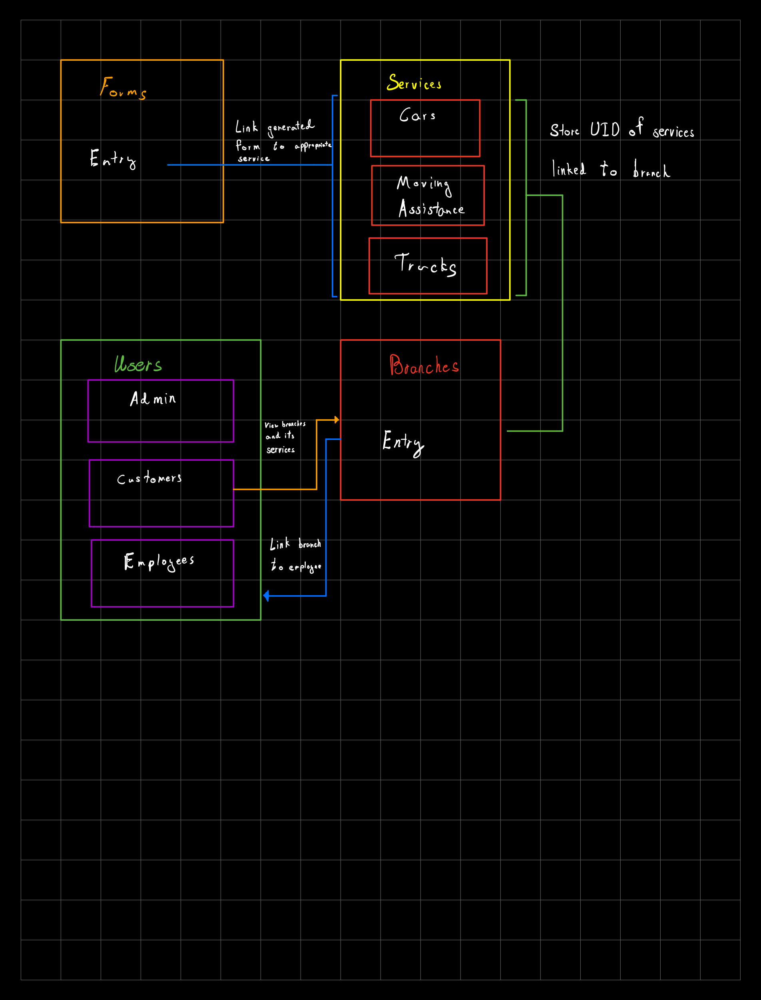
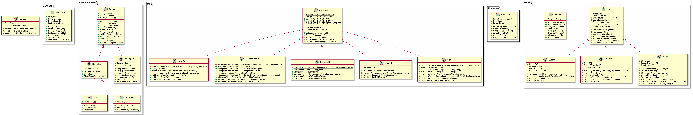
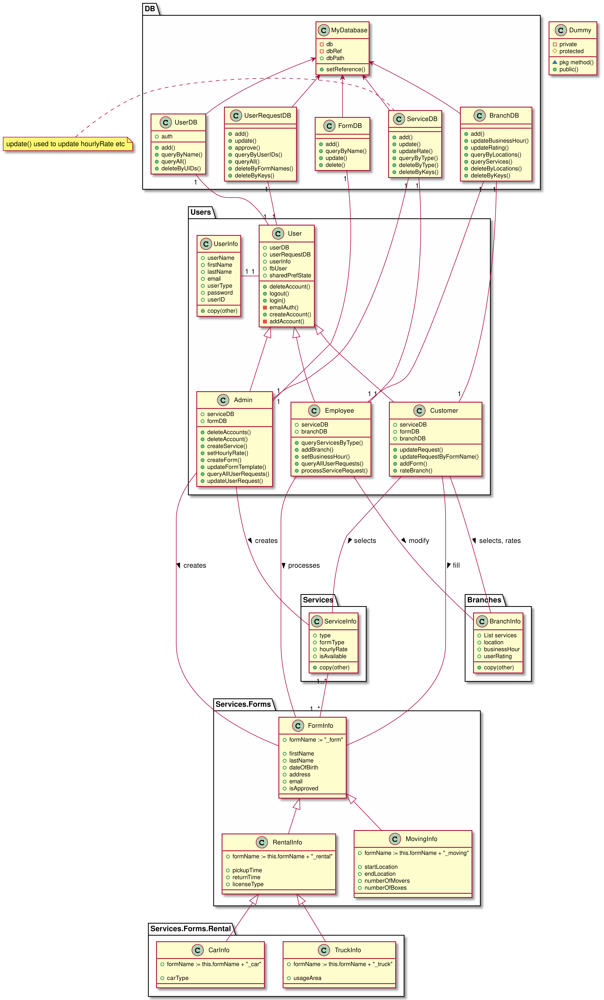

# SEG2105_F21 Project Group 43

| Projct SDK nfo       | Language Level (Java) |
|----------------------|-----------------------|
| Android API Level 31 | (SDK default) 11      |

# Group Members

| Name          | Student Number |
|---------------|----------------|
| Kurtis Yang   | 300125223      |
| Zarvaan Bacha | 300128068      |


- Database structure (contains all credentials/data):
  - [Firebase Realtime Databaes Json Export](./demo/byblos-23f4a-default-rtdb-export.json)

- Administrator Account:
  - Email: `admin@admin.com`
  - Password: `_admin`

- Customer Account
  - Email: `homersimp@gmail.com`
  - Password: `password`

- Employee accounts:
  - Email: `gr@gmail.com`
  - Password: `password`

  - Email: `rh@gmail.com`
  - Password: `password`

  - Email: `ccdd@ic.com`
  - Password: `666666`
  

- Final UML
  


---
# Prototyping

- Since We used firebase as our main database backend: [firebase_emulator](./firebase_emulator)
  - during the prototyping, we used the Firebase Emulator to speed up the back-end test since it works off-line.

- We used some Espresso Instrumentation tests for our front-end functionalities.

- We used Fragment in our fornt-end design to make it more appealing
  - however, we were limited by them time and knowledge we had to implement all the required functionalities as the manual requested

- We provide all the design / prototyping files we have came up with so far under the [demo](./demo) folder
  - It contains all the deliverable UMLs, some demo videos, and DB structure drafts
  - Since we went through several iterations for our back-end and front-end design
    - they might differs across different deliverables


- Directroy Structure of `./demo/`:
```
./demo/

├── deliverable_1
│   ├── app-debug-deli-1.apk
│   ├── db_activity_digram_Zarvaan_v0.1.png
│   ├── flow_diagram_Kurtis_v0.1.png
│   ├── record.mp4
│   └── UML
│       ├── UML.png
│       ├── UML.puml
│       └── UML.svg
├── deliverable_2
│   ├── README.md
│   └── UML_draft.puml
├── deliverable_3
│   ├── README.md
│   └── UML_draft.puml
├── deliverable_4
│   ├── app-debug.apk
│   ├── espresso_test_record.mp4
│   ├── UML.png
│   ├── UML.puml
│   └── UML.svg
└── Prototyping
    ├── Database_Structure_Branch.png
    ├── DB-Structure-Prototyping-v0.3.1.png
    ├── DB-Structure-Prototyping-v2.png
    ├── README.md
    ├── UML_Implementation.png
    ├── UML_Implementation.puml
    ├── UML_Implementation.svg
    ├── UML_Prototyping.png
    ├── UML_Prototyping.puml
    └── UML_Prototyping.svg
```

## Project Demos

### deliverable_1-3

- db_activity_digram_Zarvaan_v0.1
  

- flow_diagram_Kurtis_v0.1
  

- record
  [record.mp4](./demo/deliverable_1/record.mp4)

- UML
  


### deliverable_4

- espresso_test_record
  [espresso_test_record.mp4](./demo/deliverable_4/espresso_test_record.mp4)
- UML
  


### Prototyping

- Database_Structure_Branch
  

- DB-Structure-Prototyping-v0.3.1
  

- DB-Structure-Prototyping-v2
  

- UML_Implementation
  

- UML_Prototyping
  

