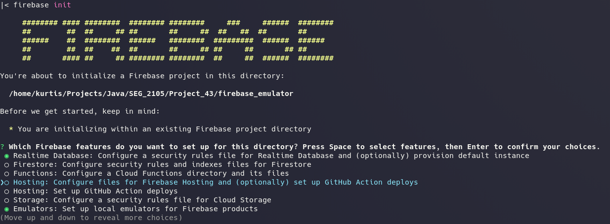
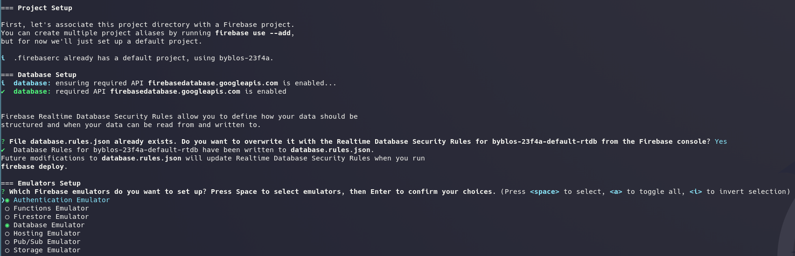

# Local Emulator Suite

- [Firebase Local Emulator Suite](https://firebase.google.com/docs/emulator-suite)

## Setting up

0. first, follow and install the firebase-tools: [cli-windows](https://firebase.google.com/docs/cli#install-cli-windows)
  - tl;dr: windows binary download: [https://firebase.tools/bin/win/instant/latest](https://firebase.tools/bin/win/instant/latest)

1. `firebase login`

2. `firebase init`
  * select: real-time database, emulator
  - 
  * select: authentication, database emulators
  - 

3. `firebase emulators:start --import=./dump --export-on-exit`
  - this will keep the local database persistent

## In Java
- for example, in Java, to get the database reference
    ```
    FirebaseDatabase database = FirebaseDatabase.getInstance("http://localhost:9000/?ns=byblos-23f4a");
    ```
